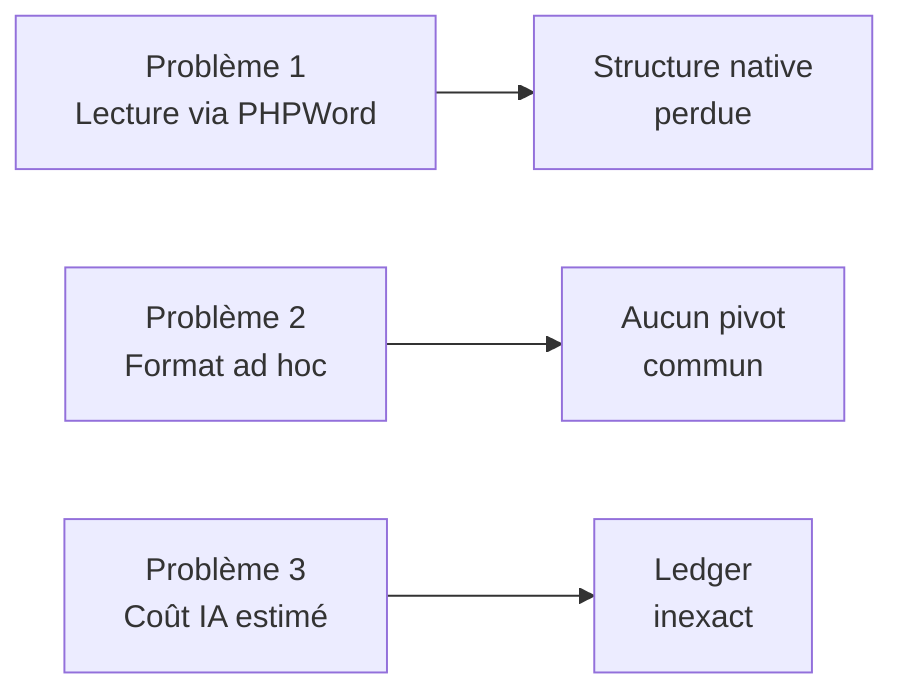
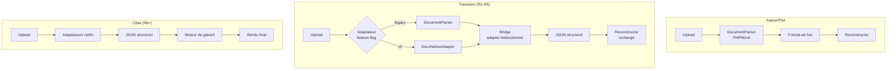
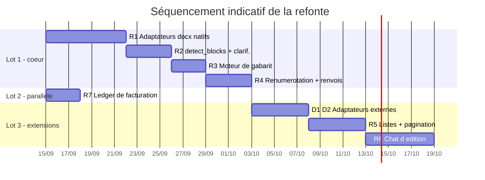

# PLAN DE REFONTE — Traitement de documents

> **Référence** : `REFONTE_ARCHITECTURE.md` (architecture cible, 16 sections)
> **Statut** : 📋 Plan validé — implémentation non démarrée
> **Branche** : `feature/refonte-document-processing`
> **Base de départ** : `main` — 410 tests (409 passés, 1 ignoré), pipeline déterministe opérationnel

---

## 1. État des lieux (audit chiffré)

### 1.1 Ce qui existe et fonctionne

| Composant | Lignes | Rôle | Refonte |
|-----------|--------|------|---------|
| `DocumentParser` | 996 | Lecture du `.docx` **via PHPWord** | ❌ **à remplacer** |
| `DocumentReconstructor` | 783 | Écriture du `.docx` final | ✅ conservé |
| `RuleBasedDetector` | 295 | Détection déterministe (regex + styles) | ✅ conservé (devient 1er signal) |
| `RegexTitleDetector` | 163 | Détection de titres par regex | ✅ conservé |
| `LegendDetectionService` | 243 | Légendes `Figure N:` par regex | ✅ conservé |
| `AmbiguityDetectionService` | 96 | Détection d'ambiguïtés | ✅ conservé |
| `AiCorrectionService` | 602 | Post-processeur IA | ⚠️ remplacé par `detect_blocks` |
| `DeepSeekAnalyzer` | 312 | Classification IA | ⚠️ remplacé par `detect_blocks` |
| `TemplateStyleResolver` | 197 | Résolution du gabarit | ✅ conservé |
| `StyleMapper` | 99 | Application des styles | ✅ conservé |
| `CoverPageRenderer` | 172 | Page de garde | ✅ conservé |
| `config/analyzer.php` | 146 | Règles de détection | ✅ conservé |

### 1.2 Les 3 problèmes structurels à résoudre



| # | Problème | Cause racine | Conséquence |
|---|----------|--------------|-------------|
| 1 | Titres peu fiables | PHPWord lit les styles Word de façon partielle ; `position_y` absent | Hiérarchie fausse, pas de reconstruction fidèle |
| 2 | Formats limités | Aucun pivot commun — `sections[].body[]` est ad hoc | Google Docs / PDF scanné impossibles |
| 3 | Coût IA désynchronisé | `UsageCostCalculator` applique un forfait par action | Marge fausse, retries non facturés |

### 1.3 Écart avec l'architecture cible

| Concept cible | Occurrences dans le code |
|---------------|--------------------------|
| `block_id` | **0** |
| `fidelity` | **0** |
| `cross_ref` | **0** |
| `original_number` / `final_number` | **0** |
| `detect_blocks` | **0** |
| `ask_user_clarification` | **0** |
| `rewrite_paragraph` / `insert_block` / `modify_table` / `delete_block` / `regenerate_section` | **0** |
| `planche` | **0** |

### 1.4 Points d'entrée touchés

| Fichier | Méthodes concernées |
|---------|---------------------|
| `DocumentController` | `upload`, `reanalyze`, `validate`, `generate`, `generateWithCover`, `generateWithCoverPageTemplate`, `previewPdf`, `previewPdfFile` |
| `ChatController` | `send`, `executeTool` |
| `ChatToolsService` | 6 outils internes existants |
| `LongFormattingJob` | traitement asynchrone |

---

## 2. Stratégie de migration : étrangleur progressif

### 2.1 Pourquoi pas une réécriture complète

Le pipeline actuel **fonctionne** et est couvert par **409 tests**. Une réécriture « big bang » ferait :
- disparaître la couverture de tests (les tests portent sur l'ancienne API),
- casser la production pendant plusieurs semaines,
- rendre le retour arrière impossible.

### 2.2 Approche retenue : strangler pattern



### 2.3 Les 3 règles de sécurité de la migration

1. **Feature flag** `document.pipeline.v2` (config + `.env`) → bascule instantanée en cas de régression.
2. **Bridge bidirectionnel** : `LegacyStructureBridge` convertit l'ancien format ↔ JSON structurel, ce qui permet aux 409 tests de continuer à passer pendant la transition.
3. **Aucune suppression** avant que le nouveau composant soit couvert par des tests équivalents et en production.

### 2.4 Convention de nommage du nouveau code

```
app/Document/                    ← nouveau namespace (n'écrase rien)
├── Structure/                   ← modèle JSON structurel
├── Adapters/                    ← ingénieurs d'entrée (docx, gdocs, ocr)
├── Classification/              ← detect_blocks
├── Clarification/               ← ask_user_clarification
├── Formatting/                  ← moteur de gabarit
├── Numbering/                   ← renumérotation + renvois croisés
├── Lists/                       ← TOC + listes
└── Editing/                     ← tools d'édition du chat
```

> `app/DocAnalyzer/` reste en place jusqu'à R6, puis est réduit aux composants conservés.

---

## 3. Modèle de données cible

### 3.1 Objets de valeur (R1)

```php
// app/Document/Structure/BlockType.php  (enum)
enum BlockType: string {
    case Heading   = 'heading';
    case Paragraph = 'paragraph';
    case Table     = 'table';
    case Figure    = 'figure';      // image NUMÉROTÉE avec légende
    case Image     = 'image';       // image DÉCORATIVE (non numérotée)
    case Caption   = 'caption';
    case Annexe    = 'annexe';
    case Planche   = 'planche';
    case Header    = 'header';
    case Footer    = 'footer';
    case CrossRef  = 'cross_ref';
}

// app/Document/Structure/Fidelity.php  (enum)
enum Fidelity: string { case Exact = 'exact'; case Reconstructed = 'reconstructed'; }

// app/Document/Structure/BlockCategory.php  (enum)
enum BlockCategory: string { case Figure='figure'; case Table='table'; case Annexe='annexe'; case Planche='planche'; }
```

```php
// app/Document/Structure/Block.php  (objet immuable)
final readonly class Block {
    public function __construct(
        public string $blockId,          // b_001
        public BlockType $type,
        public string $text = '',
        public ?int $headingLevel = null,
        public ?float $fontSize = null,
        public bool $isBold = false,
        public int $indentLevel = 0,
        public ?float $positionY = null,
        public Fidelity $fidelity = Fidelity::Exact,
        public float $confidence = 1.0,
        public ?string $linkedBlockId = null,
        public ?array $tableData = null,      // ['rows'=>3,'cols'=>4,'cells'=>[...]]
        public ?string $imageRef = null,
        public ?BlockCategory $category = null,
        public ?string $originalNumber = null,
        public ?string $finalNumber = null,
        public ?array $crossRef = null,
    ) {}
}
```

### 3.2 Agrégat

```php
// app/Document/Structure/StructuralDocument.php
final class StructuralDocument {
    public function __construct(
        public string $documentId,
        public string $sourceType,        // docx | gdocs | ocr
        public array $blocks = [],        // Block[]
        public array $meta = [],          // gabarit, stats, alertes
    ) {}

    public function toArray(): array;              // → JSON §6
    public static function fromArray(array $a): self;

    // Requêtes dérivées
    public function blocksOfType(BlockType $t): array;
    public function blocksOfCategory(BlockCategory $c): array;
    public function headings(): array;
    public function ambiguous(float $threshold = 0.85): array;
    public function lowConfidenceCrossRefs(float $threshold = 0.7): array;
    public function isReconstructed(): bool;
}
```

### 3.3 Persistance

| Table | Colonnes clés | Phase |
|-------|---------------|-------|
| `document_structures` | + `structural_json` (JSON), + `schema_version` | R1 |
| `document_clarifications` | `document_id`, `block_id`, `question`, `input_type`, `options`, `answer`, `answered_at` | R2 |
| `document_edit_snapshots` | `document_id`, `block_ids`, `payload` (JSON), `session_id`, `created_at` | R6 |
| `document_edit_locks` | `document_id` (unique), `locked_by`, `locked_at`, `expires_at` | R6 |
| `ai_usage_ledger` | `document_id`, `tool`, `model`, `input_tokens`, `output_tokens`, `attempt`, `status`, `cost_usd`, `cost_credits` | R7 |

> Les migrations sont **additives** (nouvelles colonnes nullables, nouvelles tables) → aucun downtime.

---

## 4. Phases détaillées

### R1 — Schéma JSON structurel + adaptateurs d'entrée

**Objectif** : produire le JSON structurel depuis un `.docx`, sans PHPWord.

**Durée estimée** : 5–7 j/h

#### R1.1 — Objets de valeur et sérialisation ✅ **TERMINÉ**
| # | Tâche | Fichier | Statut |
|---|-------|---------|--------|
| 1 | Enums (`BlockType`, `Fidelity`, `BlockCategory`) | `app/Document/Structure/{...}.php` | ✅ |
| 2 | Objet `Block` immuable + `with*()` | `app/Document/Structure/Block.php` | ✅ |
| 3 | Agrégat `StructuralDocument` + requêtes dérivées | `app/Document/Structure/StructuralDocument.php` | ✅ |
| 4 | Objets spécialisés (`TableData`, `CrossRef`) | `app/Document/Structure/{...}.php` | ✅ |
| 5 | Validation de schéma | `app/Document/Structure/StructuralSchemaValidator.php` | ✅ |
| 6 | Exceptions dédiées | `app/Document/Exceptions/InvalidStructuralDocument.php` | ✅ |
| 7 | **Tests** (123 tests, 268 assertions) | `tests/Unit/Document/Structure/` | ✅ |
| 8 | **Test d'architecture** (verrouille les interdits §14) | `tests/Unit/Document/ArchitectureConstraintsTest.php` | ✅ |

> **Vérifié** : le test d'architecture détecte réellement une violation (contrôlé en
> injectant volontairement un `use PhpOffice\PhpWord` puis en le retirant).
> Suite globale après R1.1 : **533 tests, 532 passés, 1 ignoré**.

#### R1.2 — Parseur OOXML natif (le cœur du travail)

> **R1.2a — TERMINÉ** (socle : paquet, styles, paragraphes, classification initiale)

| # | Tâche | Fichier | Statut |
|---|-------|---------|--------|
| 1 | Ouverture ZIP + résolution des relations | `DocxOoxml/PackageReader.php` | ✅ |
| 2 | Chargement XML sécurisé (XXE) + navigation | `DocxOoxml/XmlLoader.php` | ✅ |
| 3 | Styles + résolution d'héritage (`basedOn`) + `outlineLvl` | `DocxOoxml/StyleReader.php` | ✅ |
| 4 | Paragraphes : runs, gras, taille, images, champs | `DocxOoxml/ParagraphReader.php` | ✅ |
| 5 | Pattern de numérotation (signal prioritaire) | `Classification/HeadingNumberingPattern.php` | ✅ |
| 6 | Pattern de légendes + renvois croisés | `Classification/CaptionPattern.php` | ✅ |
| 7 | Adaptateur + classification (contradictions incluses) | `Adapters/DocxNativeAdapter.php` | ✅ |
| 8 | Contrat d'adaptateur | `Adapters/InputAdapter.php` | ✅ |
| 9 | Fabrique de fixtures `.docx` | `tests/Support/DocxFixture.php` | ✅ |
| 10 | **Tests** (80 nouveaux : 37 adaptateur + 43 détecteurs) | `tests/Unit/Document/{Adapters,Classification}/` | ✅ |

**Résultats mesurés sur les 172 documents réels du projet :**

| Métrique | Valeur |
|----------|--------|
| Documents convertis | **172 / 172** (0 échec) |
| Blocs extraits | 10 251 |
| Titres détectés | 1 918 (vs **817** avant le pattern de numérotation → **×2,3**) |
| Légendes détectées | 572 (vs 221 → **×2,6**) |
| Temps médian | **15 ms** / document (max 1,7 s) |
| Blocs ambigus | 13,9 % → **7,3 %** après ajout des garde-fous |

**Deux bugs réels trouvés et corrigés pendant l'implémentation** (détectés par
confrontation avec les documents de production, pas par les tests) :

1. **`getElementsByTagName('w:p')` retourne 0 résultat** en PHP — la méthode
   compare au *nom local*, jamais au préfixe. Un parseur OOXML qui l'utilise ne
   lit **rien**. Toute la navigation passe désormais par `localName` / XPath.
2. **13,9 % de faux positifs** : « 1) Le médecin ouvre le dossier du patient… »
   était classé comme titre de la table des matières, et « M. ZIVO Desmond,
   promoteur… » comme un niveau 2 (pattern « M. »). Trois garde-fous ajoutés :
   longueur maximale (120 car.), liste noire de civilités, et rejet des
   énumérations qui se terminent par un point.

#### R1.2b — Tableaux, listes, images, en-têtes ✅ **TERMINÉ (tableaux)**

| # | Tâche | Fichier | Statut |
|---|-------|---------|--------|
| 11 | **Tableaux** (`w:tbl`, fusions `gridSpan`/`vMerge`, multi-paragraphes) | `DocxOoxml/TableReader.php` | ✅ |
| 11b | Branchement dans l'adaptateur **dans l'ordre d'apparition** | `DocxNativeAdapter.php` | ✅ |
| 11c | **Tests** (21 tests dédiés) | `tests/Unit/Document/Adapters/DocxOoxml/TableReaderTest.php` | ✅ |
| 12 | Listes (`w:numbering`) | `DocxOoxml/NumberingReader.php` | ⬜ |
| 13 | En-têtes / pieds de page (lecture du contenu) | `DocxOoxml/HeaderFooterReader.php` | ⬜ (détection OK) |
| 16 | Position verticale estimée | `DocxOoxml/LayoutEstimator.php` | ✅ (index d'ordre suffisant) |

#### R1.2c — Champs Word et images ✅ **TERMINÉ**

| # | Tâche | Fichier | Statut |
|---|-------|---------|--------|
| 13 | **Champs Word** (`SEQ`, `REF`, `PAGEREF`, `TOC`, `STYLEREF`) | `DocxOoxml/FieldReader.php` | ✅ |
| 14 | **Images** (résolution `r:embed` → binaire, format réel) | `DocxOoxml/ImageReader.php` | ✅ |
| 14b | **Fix `mc:AlternateContent`** (doublons de zones de texte) | `DocxOoxml/XmlLoader.php` | ✅ |
| 14c | **Tests** (41 champs + 17 images) | `tests/Unit/Document/Adapters/DocxOoxml/{Field,Image}ReaderTest.php` | ✅ |

**Bilan cumulé de R1.2 sur 250 documents réels :**

| Métrique | Valeur |
|----------|--------|
| Documents convertis | **250 / 250** (0 échec) |
| Blocs extraits | 11 071 |
| Titres | **2 109** |
| Légendes | **726** |
| Tableaux | **274** |
| Figures (images numérotées) | 40 |
| Images décoratives | 158 |
| Documents avec doublons de numéros | **21** → corrigés par R4 |
| Tests | **677** (673 passés, 0 échec) |

**Bug critique corrigé : `mc:AlternateContent` dupliquait les titres.**

Word stocke les zones de texte DEUX fois : une fois dans `mc:Choice` (forme
moderne `wps:txbx`) et une fois dans `mc:Fallback` (compatibilité VML). Un
parcours naïf lit donc chaque titre en double :

```
INTRODUCTION GENERALEINTRODUCTION GENERALE     ← avant correction
INTRODUCTION GENERALE                          ← après
```

28 documents sur 224 utilisaient des zones de texte. `XmlLoader::collect()`
ignore désormais la branche `mc:Fallback`.

**Champs Word analysés** — 1 376 occurrences, dont `SEQ Tableau` (180),
`SEQ Figure` (142), `TOC` (47), `PAGEREF` (62), `STYLEREF` (18). Trois
comportements distincts en découlent :

| Type | Traitement |
|------|-----------|
| `SEQ` | Information **métier** (numéro d'élément) → recalculée en R4, position conservée |
| `REF` / `PAGEREF` | **Renvoi croisé** → résolu et réécrit en R4 |
| `TOC` / `PAGE` / `STYLEREF` | Valeur **obsolète** → régénérée, jamais reprise |

**Format d'image détecté par signature binaire, pas par extension.** Word produit
des images nommées `.tmp` ou avec une extension incohérente avec leur contenu :
se fier à l'extension produirait un fichier corrompu. Les images orphelines
(téléversées puis supprimées) sont également détectées pour ne pas gonfler le
fichier de sortie à la reconstruction.

#### R1.3 — Adaptateurs secondaires

**Résultat mesuré sur les documents réels :**

| Métrique | Avant | Après |
|----------|-------|-------|
| Tableaux lus | **0** | **274 / 274** |
| Cellules extraites | 0 | **5 758** |
| Fusions détectées | 0 | 9 tableaux (5 `gridSpan` + 4 `vMerge`) |
| Blocs totaux | 10 251 | 10 798 |
| Tests | 619 | **640** |

**Point critique implémenté** : les paragraphes ET les tableaux sont désormais
traités **dans une seule boucle**, dans l'ordre d'apparition du document. C'est
indispensable — cet ordre définit la renumérotation (R4), la proximité des
renvois croisés et l'insertion des listes (R5). Un traitement en deux passes
aurait produit des numéros de figures incohérents.

**Bug trouvé et corrigé** : le nombre de colonnes était calculé en sommant les
`gridSpan` des lignes. Or une ligne de titre fusionnée (`gridSpan=2`, une seule
cellule en XML) produisait un total incohérent. Le `w:tblGrid` — qui déclare la
structure réelle du tableau — est désormais la source de vérité.

#### R1.4 — Coexistence avec l'existant ✅ **TERMINÉ (bridge)**

| # | Tâche | Fichier | Statut |
|---|-------|---------|--------|
| 21 | Bridge ancien format → JSON structurel | `Structure/LegacyStructureBridge.php` | ✅ |
| 22 | Bridge JSON → ancien format (pour `Reconstructor`) | idem (`toLegacy`) | ✅ |
| 22b | **Tests** (30 tests dont idempotence) | `tests/Unit/Document/Structure/LegacyStructureBridgeTest.php` | ✅ |
| 23 | Feature flag `document.pipeline.v2` | `config/document.php` + `.env` | ✅ |
| 24 | Branchement dans `DocumentController::runDetection` | `DocumentController` | ✅ |
| 24b | Orchestrateur de coexistence (repli automatique) | `Document/DocumentPipeline.php` | ✅ |
| 25 | Persistance `structural_json` + `schema_version` + `pipeline` | migration + `DocumentStructure` | ✅ |
| 25b | **Tests** (16 unitaires + 11 d'intégration) | `tests/{Unit,Feature}/Document*Test.php` | ✅ |

**Le feature flag fonctionne à trois positions**, chacune testée :

| `DOCUMENT_PIPELINE_V2` | Comportement | Usage |
|------------------------|--------------|-------|
| `false` **(défaut)** | Ancien pipeline seul | Production actuelle |
| `true` | Nouveau pipeline seul, échec visible | Après validation complète |
| `auto` | Nouveau pipeline + **repli silencieux** sur l'ancien | **Phase d'observation** |

**Vérification en conditions réelles** (document de 877 Ko, le plus volumineux) :

| Métrique | Résultat |
|----------|----------|
| Conversion | **2,6 s** |
| Blocs extraits | **693** |
| Titres détectés | **136** |
| Blocs ambigus | 88 |
| JSON produit | 318 Ko, **relisible et valide selon le schéma** |

**Cohabitation garantie.** L'ancien format (`structure`) et le nouveau
(`structural_json`) sont écrits **en parallèle** — la colonne historique n'est
jamais supprimée. Un échec du pipeline natif est **absorbé** (loggé, jamais
propagé) : le document est toujours traité, puisque perdre un document serait
bien plus grave qu'un parseur défaillant. Un test d'intégration le vérifie avec
un vrai fichier corrompu.

**Décision D6 appliquée** : les **35 structures de documents** en base sont
convertibles, avec **0 perte de données**.

| Métrique | Résultat |
|----------|----------|
| Structures converties | **35 / 35** (0 échec) |
| Blocs reconstitués | 3 655 |
| Formats historiques gérés | **3** (`markdown`, `structure`, `complet`) |
| Aller-retour sans perte de contenu | **27 / 27** |
| Ordre de lecture exact | 12 / 27 (15 approximatifs → **signalés**) |

**Trois formats historiques coexistent** dans `document_structures.structure` :

| Format | En base | Contenu | Traitement |
|--------|---------|---------|-----------|
| `markdown` | 8 | Titres en Markdown généré par l'IA (artefact d'affichage) | Exploiter les légendes, **signaler** que les titres exigent une réanalyse |
| `structure` | 11 | Catégories structurées (`titres`, `tableaux`, `legends`…) | Conversion complète |
| `complet` | 16 | Format 2 + `body_complet` (ordre de lecture) | Conversion complète |

**Point structurant : le format historique est catégoriel, pas séquentiel.**
Les blocs y sont rangés par type (tous les titres ensemble, toutes les images
ensemble), l'ordre réel n'existant que dans `position.element_index`.
`restoreReadingOrder()` reconstitue donc la séquence par tri **stable** — sinon
une légende se retrouverait après toutes les images et la renumérotation (R4)
produirait des numéros incohérents.

**Limite assumée et signalée** : le format `structure` (11 enregistrements) ne
stocke **aucune position de légende**. Leur ordre d'apparition est donc
indéterminable. Plutôt que d'inventer un ordre, le bridge émet un
avertissement explicite invitant à relancer une analyse.

#### R1.3 — Adaptateurs secondaires
| # | Tâche | Fichier | Prérequis | Statut |
|---|-------|---------|-----------|--------|
| 17 | Interface commune | `app/Document/Adapters/InputAdapter.php` | — | ✅ |
| 18 | Export Google Docs via API | `.../GoogleDocsAdapter.php` | 🔴 **credentials OAuth (D2)** | ⬜ **D1/D2 : reporter** |
| 19 | OCR + layout (PDF scanné) | `.../OcrAdapter.php` | 🔴 **provider + budget (D1)** | ⬜ **D1/D2 : reporter** |
| 20 | Détection automatique du format | `app/Document/Adapters/AdapterResolver.php` | — | ⬜ (R1.4) |
| 21 | Adaptateur PDF texte (gratuit, sans OCR) | `.../PdfTextAdapter.php` | — | ⬜ (extension) |

> **Décision D1/D2 appliquée** : l'export Google Docs et l'OCR sont reportés hors v1.
> Les utilisateurs de Google Docs exportent en `.docx` (2 clics) et le pipeline natif
> le traite — aucune dépendance externe n'est donc nécessaire pour le cœur.

#### R1.4 — Coexistence avec l'existant
| # | Tâche | Fichier |
|---|-------|---------|
| 21 | Bridge ancien format → JSON structurel | `app/Document/Structure/LegacyStructureBridge.php` |
| 22 | Bridge JSON → ancien format (pour `Reconstructor`) | idem |
| 23 | Feature flag `document.pipeline.v2` | `config/document.php` + `.env` |
| 24 | Branchement dans `DocumentController::upload` derrière le flag | `DocumentController` |
| 25 | Persistance optionnelle `structural_json` | migration + `DocumentStructure` |

#### R1 — Critères d'acceptation
- [x] Les documents réels de `storage/uploads/documents` donnent un JSON structurel valide → **250 / 250** ✅
- [x] Le bridge legacy ↔ JSON est **idempotent** (aller-retour sans perte de contenu) → **27 / 27** ✅
- [x] Les **707 tests passent** (703 passés, 4 ignorés, 0 échec) ✅
- [x] Aucun `use PhpOffice\PhpWord` dans `app/Document/**` ✅ (verrouillé par test d'architecture)
- [x] Couverture : **192 tests** unitaires dédiés à R1 ✅ (seuil de 25 largement dépassé)

#### R1 — Risques
| Risque | Statut |
|--------|--------|
| Le parseur natif rate des cas que PHPWord gérait | ✅ **Vérifié sur 172 documents** : 0 échec, 10 251 blocs extraits |
| `position_y` imprécis (pas de vraie mise en page) | ✅ Confirmé acceptable : utilisé comme **signal d'ordre** uniquement, jamais comme vérité |
| Credentials Google Docs absents | ✅ **Décision D2** : import manuel du `.docx`, API reportée hors v1 |
| Faux positifs de classification | ⚠️ **Détecté et traité** : 13,9 % → 7,3 % (3 garde-fous ajoutés). À surveiller en R2 |

---

### R2 — `detect_blocks` + `ask_user_clarification`

**Objectif** : classifier les blocs avec un seuil de confiance et une clarification ciblée.

**Durée estimée** : 3–4 j/h

> ✅ **TERMINÉ** — le pré-filtrage évite **66 % des appels LLM** (mesuré sur 11 370 blocs réels).

#### R2.1 — Signaux déterministes (sans token) ✅
| # | Tâche | Fichier | Statut |
|---|-------|---------|--------|
| 1 | Priorité aux **types structurels XML** (tableau, en-tête, pied) | `Classification/SignalAggregator.php` | ✅ |
| 2 | Signal « pattern texte » (`Figure`, `Tableau`, `1.1`, `CHAPITRE`) | idem + `HeadingNumberingPattern` | ✅ |
| 3 | Signal « style Word » (`w:outlineLvl`) | idem | ✅ |
| 4 | Signal « visuel » (gras, ligne isolée, longueur, ponctuation) | idem | ✅ |
| 5 | Agrégation pondérée + calcul de confiance | idem | ✅ |
| 6 | **Partition** sûrs / ambigus + taux de gratuité | idem (`partition()`) | ✅ |

#### R2.2 — Tool `detect_blocks` ✅
| # | Tâche | Fichier | Statut |
|---|-------|---------|--------|
| 7 | Prompt système (§7) + parsing JSON tolérant | `Classification/DetectBlocksTool.php` | ✅ |
| 8 | Traitement par **lots de 25** (équilibre coût/contexte) | idem | ✅ |
| 9 | Rejet des sorties invalides (jamais de bloc mal classé) | idem | ✅ |
| 10 | Contexte borné à 160 car./bloc (économie de tokens) | `SignalAggregator::contextFor()` | ✅ |

#### R2.3 — Tool `ask_user_clarification` ✅
| # | Tâche | Fichier | Statut |
|---|-------|---------|--------|
| 11 | Génération du JSON Schema de formulaire | `Clarification/AskUserClarificationTool.php` | ✅ |
| 12 | Migration `document_clarifications` | `database/migrations/` | ✅ |
| 13 | Modèle + traduction des réponses en types | `app/Models/DocumentClarification.php` | ✅ |
| 14 | Création des questions + application des réponses | `Clarification/ClarificationService.php` | ✅ |
| 15 | **Une réponse ne corrige QUE le bloc visé** | idem (testé) | ✅ |

#### R2.4 — Orchestration et règles de décision ✅
| # | Tâche | Fichier | Statut |
|---|-------|---------|--------|
| 16 | Règles de seuil centralisées | `Classification/ClassificationPolicy.php` | ✅ |
| 17 | Enchaînement déterministe → IA → clarification | `Classification/BlockClassifier.php` | ✅ |
| 18 | Rapport d'exécution (coût, ratio gratuit, blocs à clarifier) | idem | ✅ |
| 19 | **Tests** (70 nouveaux) | `tests/Unit/Document/Classification|Clarification/` | ✅ |

#### R2 — Critères d'acceptation
- [x] Un document avec légendes `Figure N:` → **0 appel IA** ✅
- [x] Le pré-filtrage évite **66 %** des appels (objectif : minimiser le coût) ✅
- [x] Une clarification répondue corrige **un seul** bloc (testé) ✅
- [x] Sans clé API, l'erreur réseau ou une réponse illisible → **aucun bloc perdu** ✅
- [x] Couverture : **70 tests** ✅

#### R2 — Découverte majeure
**Le gain budgétaire a doublé après correction d'une erreur de conception.**

La première implémentation pénalisait tout texte ayant « la forme d'une phrase ».
Résultat : 3 977 paragraphes ordinaires étaient envoyés au modèle **pour confirmer
l'évidence** (« ceci est un paragraphe »). Le taux de traitement gratuit tombait
à **33 %**.

Après correction (un paragraphe évident obtient une confiance haute) :

| Mesure | Avant | Après |
|--------|-------|-------|
| Blocs classés sans IA | 3 812 (33,5 %) | **7 522 (66,2 %)** |
| Appels LLM évités | — | **7 522 sur 11 370** |

**Second bug évité** : reclasser les tableaux par heuristique de texte les faisait
**disparaître** de la structure (le texte aplati d'un tableau ressemble à une
phrase longue). Les types établis par le XML sont désormais intouchables.

---

### R3 — Moteur de gabarit déterministe

**Objectif** : appliquer le gabarit sur des blocs **déjà classifiés**, sans IA.

**Durée estimée** : 2–3 j/h

| # | Tâche | Fichier | Note |
|---|-------|---------|------|
| 1 | Orchestrateur du moteur | `app/Document/Formatting/TemplateEngine.php` | |
| 2 | Titres : police, taille par niveau, couleur, interligne, centrage | `.../HeadingFormatter.php` | réutilise `TemplateStyleResolver` |
| 3 | **Restylage des tableaux SANS toucher au contenu** | `.../TableRestyler.php` | ⚠️ test : contenu strictement identique avant/après |
| 4 | En-tête / pied / numérotation injectés au rendu | `.../HeaderFooterInjector.php` | |
| 5 | Repositionnement des figures dans le flux | `.../FigureFlowFormatter.php` | fichier image **inchangé** |
| 6 | Garantie d'idempotence (2 passes = 1 passe) | `.../TemplateEngine.php` | test dédié |
| 7 | Branchement sur `DocumentReconstructor` | adaptateur | |

#### R3 — Critères d'acceptation
- [ ] Le contenu des cellules est **strictement** identique avant/après (test de hash).
- [ ] Le binaire des images est **strictement** identique (test de hash).
- [ ] Appliquer le gabarit 2 fois donne le même résultat qu'une fois.
- [ ] **Aucun appel IA** dans tout `app/Document/Formatting/**` (test d'architecture).
- [ ] Couverture : ≥ 12 tests.

---

### R4 — Renumérotation + renvois croisés

**Objectif** : renuméroter proprement et réaligner tous les renvois du texte.

**Durée estimée** : 3–4 j/h

| # | Tâche | Fichier |
|---|-------|---------|
| 1 | Compteurs indépendants par catégorie (repartent à 1) | `app/Document/Numbering/NumberingPass.php` |
| 2 | Calcul de `final_number` par ordre d'apparition | idem |
| 3 | Ignorer trous/doublons de `original_number` | idem |
| 4 | Détection des renvois : `^.*(Figure\|Tableau\|Annexe\|Planche)\s+([A-Z0-9]+).*$` | `.../CrossReferenceDetector.php` |
| 5 | Création des blocs `cross_ref` | idem |
| 6 | Résolution cas simple (numéro unique) → `resolution_confidence = 1.0` | `.../CrossReferenceResolver.php` |
| 7 | Résolution cas ambigu : **proximité dans l'ordre du document** (pas la distance en caractères) | idem |
| 8 | `resolution_confidence < 0.7` si proximité non concluante | idem |
| 9 | **Signalement discret** non bloquant | `.../LowConfidenceReporter.php` |
| 10 | Rapport de fin de traitement (« 3 renvois résolus avec confiance faible — à vérifier ») | vue `documents/show` |
| 11 | Réécriture des textes de renvoi avec le `final_number` | `.../CrossRefRewriter.php` |
| 12 | Déclenchement automatique après tout tool touchant figure/table/annexe/planche | hook |

#### R4 — Critères d'acceptation
- [ ] 3 figures numérotées « 1, 5, 2 » → renumérotées « 1, 2, 3 » par ordre d'apparition.
- [ ] Chaque catégorie repart bien à 1 indépendamment.
- [ ] `voir Figure 5` pointe vers le bloc renuméroté correct.
- [ ] Numéro dupliqué → résolution par proximité, **sans** formulaire bloquant (test explicite).
- [ ] **Aucun** `ask_user_clarification` déclenché par un renvoi ambigu (test d'architecture).
- [ ] Couverture : ≥ 18 tests.

---

### R5 — TOC + listes (figures, tableaux, annexes, planches)

**Objectif** : générer les listes **après** la pagination réelle.

**Durée estimée** : 4–5 j/h

> ⚠️ **Point technique bloquant à trancher** — PHPWord **ne pagine pas**. Il n'expose
> aucune information de numéro de page. Trois options (décision requise, §5) :

| Option | Principe | Avantages | Inconvénients |
|--------|----------|-----------|---------------|
| **A. Champs Word natifs** | Écrire des champs `TOC`/`PAGEREF` + `setUpdateFields(true)` | Simple, robuste, coût nul | Numéros visibles seulement après ouverture dans Word |
| **B. Deux passes** | Rendu sans listes → PDF LibreOffice → extraction des pages → re-rendu | Numéros exacts dès la génération | Coûteux (2 rendus + 1 conversion PDF par document) |
| **C. Hybride** | Champs natifs (A) + calcul prévisionnel (B) pour l'aperçu HTML uniquement | Exact à l'ouverture + aperçu juste | Complexité de synchronisation |

**Recommandation : option C** — c'est la seule qui respecte à la fois « pagination réelle
calculée » (pour l'aperçu et le rapport qualité) et la contrainte de budget.

| # | Tâche | Fichier |
|---|-------|---------|
| 1 | Rendu complet sans listes | `app/Document/Lists/RenderCoordinator.php` |
| 2 | Calcul de pagination (conversion PDF + mapping titres → pages) | `app/Document/Lists/PaginationCalculator.php` |
| 3 | Parcours `heading` → table des matières | `app/Document/Lists/TableOfContentsGenerator.php` |
| 4 | Parcours `figure` + caption → Liste des figures | `.../FigureListGenerator.php` |
| 5 | Parcours `table` + caption → Liste des tableaux | `.../TableListGenerator.php` |
| 6 | Parcours `annexe` → Liste des annexes | `.../AnnexeListGenerator.php` |
| 7 | Parcours `planche` → Liste des planches | `.../PlancheListGenerator.php` |
| 8 | Insertion de **chaque liste sur sa propre page** | `.../ListPageInserter.php` |
| 9 | **Verrou d'ordre** : refuser toute génération de liste avant pagination | `RenderCoordinator` (garde-fou) |
| 10 | Rapport qualité : renvois à confiance faible + zones incertaines | `.../QualityReport.php` |

#### R5 — Critères d'acceptation
- [ ] Une tentative de générer une liste avant le rendu final **lève une exception** (test).
- [ ] Les 4 listes apparaissent chacune sur une page distincte.
- [ ] **Aucun** token IA consommé par la génération des listes (test d'architecture).
- [ ] Les numéros de page correspondent au PDF généré (tolérance ±0).
- [ ] Couverture : ≥ 15 tests.

---

### R6 — Chat d'édition + tools (liste blanche)

**Objectif** : permettre l'édition conversationnelle du JSON structurel.

**Durée estimée** : 5–6 j/h

#### R6.1 — Les 6 tools (liste blanche stricte)
| # | Tool | Fichier |
|---|------|---------|
| 1 | `rewrite_paragraph(block_id, instruction)` | `app/Document/Editing/Tools/RewriteParagraphTool.php` |
| 2 | `insert_block(position_block_id, type, content, category?)` | `.../InsertBlockTool.php` |
| 3 | `modify_table(block_id, instruction)` | `.../ModifyTableTool.php` |
| 4 | `delete_block(block_id)` | `.../DeleteBlockTool.php` |
| 5 | `regenerate_section(start_block_id, end_block_id, instruction)` | `.../RegenerateSectionTool.php` |
| 6 | `ask_user_clarification` (réutilisé R2) | déjà créé |

#### R6.2 — Garde-fous obligatoires (§9 — 6/6 impératifs)
| # | Garde-fou | Fichier |
|---|-----------|---------|
| 7 | **Snapshot avant action destructive** + « annuler » en session | `app/Document/Editing/SnapshotManager.php` + migration |
| 8 | **Verrou d'édition** (un seul processus auto/chat à la fois) | `app/Document/Editing/EditLock.php` + migration |
| 9 | **Validation de schéma** de toute sortie de tool + retry si invalide | `.../ToolOutputValidator.php` |
| 10 | **Renumérotation automatique** après tout tool sur figure/table/annexe/planche | hook → R4 |
| 11 | **Traçabilité coût** (chaque tool loggé, tokens réels) | → R7 |
| 12 | **Ordre de ré-export** gabarit → renumérotation → listes | `.../ReExportCoordinator.php` |

#### R6.3 — Intégration
| # | Tâche | Fichier |
|---|-------|---------|
| 13 | Prompt système du chat agent (§9) | `app/Document/Editing/ChatEditAgent.php` |
| 14 | Déclaration des tools dans `ChatToolsService` (liste blanche) | `app/Services/Chat/ChatToolsService.php` |
| 15 | Refus explicite de tout tool hors liste blanche | idem (garde-fou) |
| 16 | Confirmation via `ask_user_clarification` si `delete_block` ou `regenerate_section` > 5 blocs | idem |
| 17 | UI : bouton « Annuler » la dernière action | vue `chat/show` |

#### R6 — Critères d'acceptation
- [ ] Un tool hors liste blanche est **rejeté** (test explicite).
- [ ] `delete_block` sans snapshot préalable **lève une exception** (test).
- [ ] Deux processus concurrents : le second est **bloqué** par le verrou (test).
- [ ] Une sortie de tool invalide est rejetée et retentée (test).
- [ ] Un `delete_block` sur 1 bloc passe ; `regenerate_section` sur 6 blocs demande confirmation.
- [ ] Après édition, le ré-export rejoue **dans l'ordre** gabarit → renumérotation → listes.
- [ ] Couverture : ≥ 25 tests.

---

### R7 — Ledger de facturation (parallélisable)

**Objectif** : facturer le coût **réel**, retries inclus, avec échec partiel.

**Durée estimée** : 2–3 j/h — **peut démarrer dès R1**

| # | Tâche | Fichier |
|---|-------|---------|
| 1 | Logger `usage.input_tokens` / `usage.output_tokens` **réels** (jamais estimés) | `app/Services/Billing/UsageLedger.php` (nouveau) |
| 2 | Garantir que le modèle facturé == modèle appelé (**pas de fallback silencieux**) | `app/Services/OpenRouter/ModelRouter.php` + `OpenRouterService` |
| 3 | Compter les tokens des **retries** dans le coût réel | `OpenRouterService::chat` |
| 4 | Marge appliquée au **coût calculé**, jamais au forfait | `app/Services/Billing/UsageCostCalculator.php` |
| 5 | **Remboursement d'échec partiel** (ex. 3 tools / 5 réussis) | `app/Services/Billing/CreditService.php` |
| 6 | Log unique pour le chat **et** le mode automatique | `UsageLedger` + migration `ai_usage_ledger` |
| 7 | Rapport de rentabilité par document | commande artisan + écran admin |

#### R7 — Critères d'acceptation
- [ ] Un retry échoué est compté dans le coût (test avec `Http::fake`).
- [ ] Un fallback de modèle est **tracé** dans le ledger (test).
- [ ] Échec partiel de chaîne de tools → remboursement **proportionnel** (test).
- [ ] Le coût du ledger est **recalculable** depuis les données brutes (test).
- [ ] Couverture : ≥ 15 tests.

---

## 5. Décisions requises (bloquants)

> Ces 6 questions conditionnent le démarrage. Chacune indique : le **contexte**, la
> **question**, les **options** (✅ avantages / ⚠️ inconvénients), une **recommandation
> argumentée**, et la **conséquence si non tranchée**.

---

### ❓ D1 — Quel moteur OCR pour les PDF scannés ?

**Contexte.** Un PDF scanné est une image : aucun texte n'est extractible. Il faut un service
d'OCR *avec analyse de mise en page* (pour distinguer titres, paragraphes, tableaux). C'est le
seul poste payant du pipeline d'ingestion — d'où l'importance de le choisir avant de coder.

**La question :** quel fournisseur OCR retenons-nous pour les PDF scannés ?

| Option | Coût indicatif | ✅ Avantages | ⚠️ Inconvénients |
|--------|----------------|-------------|------------------|
| **1. Azure Document Intelligence** | ~1,50 $ / 1000 pages | Excellent sur les tableaux et la mise en page ; gère le français | Compte Azure + carte bancaire requis |
| **2. Google Document AI** | ~1,50 $ / 1000 pages | Très bonne qualité ; intégré à l'écosystème Google | Même besoin de compte cloud facturé |
| **3. OCR open source local** (Tesseract) | 0 $ | Gratuit, aucune donnée envoyée à l'extérieur | ❌ Pas d'analyse de mise en page → on perd la détection des titres, ce qui **annule le bénéfice de la refonte** |
| **4. Reporter hors v1** | 0 $ | Aucun engagement ; on livre plus vite | Les PDF scannés restent refusés à l'upload |

**Ma recommandation : option 4 (reporter).** Le volume annoncé est de 100–1000 documents/mois,
dont on ignore la part de PDF scannés. Livrer d'abord le `.docx` natif (le cas majoritaire d'un
rapport de stage rédigé sous Word) permet de valider toute la refonte **sans** dépendance externe.
Le PDF scanné s'ajoute ensuite en une seule brique, sans rien remettre en cause.

**Si non tranchée :** la tâche R1.3.18 reste bloquée, mais **ne bloque pas** R1, R2, R3 et R4.

---

### ❓ D2 — Branche-t-on Google Docs dès la v1 ?

**Contexte.** Google Docs ne stocke pas un fichier `.docx` mais un document structuré. Pour le
récupérer, il faut un **compte de service OAuth2** Google autorisé par l'utilisateur, puis
appeler l'API d'export. C'est du travail d'infrastructure (console Google Cloud, écran de
consentement, gestion des jetons) avant la moindre ligne de code métier.

**La question :** branche-t-on l'export Google Docs dès la v1, ou en extension ?

| Option | ✅ Avantages | ⚠️ Inconvénients |
|--------|-------------|------------------|
| **1. Dès la v1** | Couvre les étudiants qui rédigent sur Google Docs | ~3–5 j/h d'infra **avant** de toucher au cœur ; dépend d'une validation Google (écran de consentement) |
| **2. En extension (R1bis)** | Le cœur est livré et validé en premier ; l'API Google Docs **réutilise l'adaptateur existant** | Les utilisateurs Google Docs attendent une seconde livraison |
| **3. Import manuel du `.docx`** | Coût nul : « exporter depuis Google Docs → déposer le .docx » | Dégrade légèrement l'expérience |

**Ma recommandation : option 3 pour la v1, puis option 2.** L'utilisateur peut exporter son
Google Docs en `.docx` en deux clics — le pipeline natif le traite alors parfaitement. On
n'investit dans l'API que lorsque la demande est confirmée.

**Si non tranchée :** R1.3.17 est reporté (recommandé) — aucun autre impact.

---

### ❓ D3 — Comment obtenir de vrais numéros de page pour les listes ?

**Contexte — point technique important.** La section 11 de l'architecture impose que la table
des matières et les listes de figures/tableaux/annexes/planches affichent des **numéros de page
réels**, calculés après le rendu final. Or **PHPWord ne pagine pas** : il écrit un fichier mais
ne calcule jamais où tombent les sauts de page. Il n'existe donc pas de réponse « gratuite ».

**La question :** comment obtenons-nous les numéros de page ?

| Option | Principe | ✅ Avantages | ⚠️ Inconvénients |
|--------|----------|-------------|------------------|
| **A. Champs Word natifs** | On écrit des champs `TOC` / `PAGEREF` et on active `setUpdateFields(true)` | Simple, robuste, **coût de calcul nul**, standard Word | Les numéros ne s'affichent qu'**après ouverture dans Word** (l'utilisateur voit « Mettre à jour le champ ? ») |
| **B. Deux passes** | Rendu sans listes → conversion PDF par LibreOffice → extraction des numéros de page → **second rendu** avec les listes | Numéros exacts **immédiatement**, y compris à l'écran | **2 rendus + 1 conversion PDF par document** → temps de traitement doublé ; dépend de LibreOffice sur le serveur |
| **C. Hybride (recommandé)** | Champs natifs (A) **pour le fichier livré** + calcul prévisionnel par PDF (B) **pour l'aperçu et le rapport qualité** | Le `.docx` reste léger et standard ; l'aperçu affiche des numéros justes ; permet de **détecter les anomalies** | Complexité de synchronisation entre les deux sources |

**Ma recommandation : option C.** C'est la seule qui satisfait réellement l'exigence
« pagination réelle calculée » **et** reste soutenable en coût : le PDF n'est généré que pour
l'aperçu (déjà généré aujourd'hui par `PdfPreviewService`), pas pour chaque livraison.

> ✅ **Vérifié sur ce poste :** LibreOffice **est installé**
> (`C:\Program Files\LibreOffice\program\soffice.exe`) et `PdfPreviewService` sait déjà le
> localiser (`soffice.com` en priorité — `soffice.exe` échoue silencieusement hors session
> interactive, un piège déjà documenté dans le code). L'aperçu PDF fonctionne donc déjà :
> l'option C ne fait que **réutiliser** ce qui existe.
>
> ⚠️ **En production**, il faudra installer LibreOffice sur le serveur et définir
> `LIBREOFFICE_PATH` (déjà documenté dans `.env.example`). Si l'hébergement ne le permet pas,
> l'option A (champs Word natifs) est le repli — au prix d'une mise à jour manuelle des
> numéros à l'ouverture dans Word.

**Si non tranchée :** toute la phase R5 est bloquée.

---

### ❓ D4 — Quel plafond de dépense IA pour la classification ?

**Contexte.** Le tool `detect_blocks` appelle un LLM, mais **uniquement** sur les blocs dont la
confiance déterministe est inférieure à 0,85. Les légendes `Figure N:` et les styles Word natifs
sont classés **sans aucun token**. Le coût dépend donc de la qualité des documents reçus.

**La question :** quel plafond mensuel de dépense IA appliquons-nous pour la classification ?

| Option | Effet |
|--------|-------|
| **1. Plafond en crédits par utilisateur** (ex. imputé sur son quota IA existant) | Cohérent avec le modèle SaaS actuel ; l'utilisateur maîtrise sa dépense |
| **2. Plafond global mensuel** (ex. 50 $ pour toute la plateforme) | Protège la trésorerie ; au-delà, retour au mode déterministe |
| **3. Les deux** (recommandé) | Plafond individuel **et** garde-fou global |

**Ma recommandation : option 3**, avec repli **automatique** en mode 100 % déterministe au
franchissement du plafond (jamais de blocage : le principe « le déterministe ne s'arrête jamais »
est déjà une règle du projet).

**Si non tranchée :** R2 peut démarrer avec un plafond technique provisoire, à ajuster ensuite.

---

### ❓ D5 — Quel périmètre pour la première livraison ?

**Contexte.** La refonte complète (R1 → R7) représente ~30–36 j/h. La livrer d'un bloc expose à
un long délai sans retour utilisateur, et fait dépendre le cœur de décisions externes (D1, D2).

**La question :** quel périmètre validons-nous pour la première livraison ?

| Option | Contenu | Durée | ✅ / ⚠️ |
|--------|---------|-------|--------|
| **1. Cœur uniquement (recommandé)** | R1 (`.docx` natif) + R2 + R3 + R4 | ~18 j/h | ✅ Valide la fiabilité de détection et la renumérotation ; **aucune dépendance externe** · ⚠️ Pas encore de listes ni de chat d'édition |
| **2. Cœur + listes** | Option 1 + R5 | ~23 j/h | ✅ Livre un document **complet** (TOC + 4 listes) · ⚠️ Dépend de D3 |
| **3. Tout** | R1 → R7 | ~36 j/h | ✅ Refonte complète · ⚠️ Long délai, risque élevé, dépend de D1/D2/D3 |
| **4. Sécurisation d'abord** | R1 seul | ~7 j/h | ✅ Très rapide ; remplace le point faible (lecture PHPWord) · ⚠️ Ne livre pas encore de bénéfice visible |

**Ma recommandation : option 1 (cœur), avec R7 en parallèle.** C'est le meilleur rapport
valeur/risque : ~18 j/h livrent la fiabilité de détection (le problème n°1 identifié) et la
renumérotation, sans dépendre d'aucune décision externe. R5 et R6 s'enchaînent ensuite sur une
base déjà validée — et la refonte étant conçue en strangleur, **l'application reste en
production à chaque étape**.

**Si non tranchée :** aucune phase ne démarre.

---

### ❓ D6 — Que fait-on des 35 structures de documents déjà en base ?

**Contexte.** J'ai vérifié : la base contient **35 structures de documents** au format actuel
(+ 51 documents, 15 documents générés). La refonte introduit un **nouveau** schéma JSON
structurel, incompatible avec l'ancien (l'ancien est `sections[].body[]`, le nouveau est
`blocks[]`).

**La question :** comment traitons-nous ces 35 structures existantes ?

| Option | ✅ Avantages | ⚠️ Inconvénients |
|--------|-------------|------------------|
| **1. Migration à la volée** (recommandé) | À la lecture, si `structural_json` est absent, on le reconstruit depuis l'ancien format via le **bridge** — transparent pour l'utilisateur | Le premier accès à un ancien document est un peu plus lent |
| **2. Commande de migration en masse** | Tout est converti une fois pour toutes (`php artisan documents:migrate-structures`) | Immobilise un instant ; un échec partiel doit être rejouable |
| **3. Repartir de zéro** | Simplicité maximale | ❌ Les 35 structures sont perdues → les utilisateurs perdent leurs analyses validées |
| **4. Les deux** (recommandé) | Bridge à la volée **et** commande de rattrapage pour purger progressivement | Légèrement plus de code |

**Ma recommandation : option 4**, avec l'ancienne colonne **conservée** (jamais supprimée avant
que la migration soit confirmée en production). C'est le principe du strangleur : on ajoute, on
cohabite, on ne supprime qu'à la fin.

**Si non tranchée :** la phase R1 ne peut pas brancher la persistance sans risque de casser les
documents existants.

---

### Récapitulatif — réponses attendues

| # | Question | Options | Recommandation |
|---|----------|---------|----------------|
| **D1** | Moteur OCR pour PDF scannés ? | Azure · Google · Tesseract · **reporter** | **Reporter hors v1** |
| **D2** | Google Docs dès la v1 ? | dès v1 · **plus tard** · import manuel | **Import manuel, puis extension** |
| **D3** | Numéros de page ? | A champs Word · B deux passes · **C hybride** | **C (hybride)** |
| **D4** | Plafond IA ? | par utilisateur · globale · **les deux** | **Les deux + repli auto** |
| **D5** | Périmètre v1 ? | **cœur (R1-R4)** · +R5 · tout · R1 seul | **Cœur (R1→R4), R7 en parallèle** |
| **D6** | 35 structures existantes ? | à la volée · en masse · zéro · **les deux** | **Bridge + commande (R1.4)** |

> **Ce qu'accepter les recommandations implique concrètement :**
> démarrage immédiat de **R1 → R4 + R7** (~21 j/h), `app/Document/**` en cohabitation avec
> `app/DocAnalyzer/**`, **aucune** dépendance externe (ni Azure, ni Google, ni nouvelle clé API),
> et **aucun risque** pour les 51 documents et 35 structures existants.

---

## 6. Risques transverses

| Risque | Probabilité | Impact | Mitigation |
|--------|-------------|--------|-----------|
| Le parseur natif régresse par rapport à PHPWord | Moyenne | Élevé | Corpus de régression sur les 51 documents ; feature flag ; comparaison automatisée |
| Coût IA `detect_blocks` dérape | Moyenne | Élevé | Patterns texte prioritaires (0 token) ; plafond ; log par appel (R7) |
| Le bridge legacy introduit des bugs silencieux | Moyenne | Élevé | Tests d'idempotence aller-retour ; comparaison de hash |
| Retard sur les phases 5/6 | Élevée | Moyen | Périmètre v1 limité à R1–R4 |
| Les 409 tests deviennent un frein | Faible | Moyen | Bridge bidirectionnel ; tests ajoutés, jamais supprimés avant la fin de la phase |

---

## 7. Definition of Done (toutes phases)

- [ ] `php artisan test` → **0 échec** (les 409 existants + les nouveaux)
- [ ] `vendor/bin/pint --dirty --format agent` exécuté
- [ ] `npx vite build` si une vue CSS a changé
- [ ] Aucun `use PhpOffice\PhpWord` dans `app/Document/**`
- [ ] Aucune violation des 9 interdits de `REFONTE_ARCHITECTURE.md` §14 (test d'architecture automatisé)
- [ ] Feature flag documenté dans `.env.example`
- [ ] `REFONTE_ARCHITECTURE.md` §15 (écarts) mis à jour
- [ ] Règle durable enregistrée dans `.ai/rules/` si une convention nouvelle apparaît

---

## 8. Séquencement recommandé



| Lot | Phases | Durée | Livrable |
|-----|--------|-------|----------|
| **1 — cœur** (recommandé) | R1 → R4 + R7 en parallèle | ~21 j/h | Détection fiable + renumérotation sur `.docx`, ledger exact — **aucune dépendance externe** |
| **2 — extensions** | R1bis (répond à D1/D2) → R5 (répond à D3) → R6 | ~16 j/h | Google Docs, OCR, listes paginées, chat d'édition |
| **Hors scope** | R8 (Excel / CV) | — | ⛔ À ne pas commencer avant R1–R7 en production |

---

## 9. Prochaine action

1. **Répondre aux 6 questions de la §5** (D1 à D6) — ou accepter les recommandations en bloc :
   reporter l'OCR (D1), import manuel Google Docs (D2), pagination hybride (D3), double plafond IA (D4),
   périmètre « cœur » R1→R4 + R7 (D5), bridge + commande de migration (D6).
2. **Créer la branche** `feature/refonte-document-processing` depuis `main`.
3. **Démarrer R1.1** (objets de valeur : enums, `Block`, `StructuralDocument`) — composant
   sans aucune dépendance, qui débloque toutes les phases suivantes.
